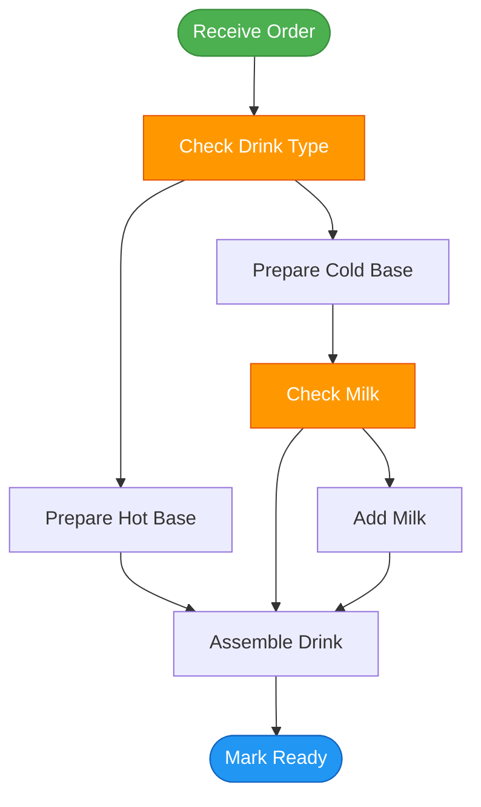

# Phase B — Generators: Journal Notes

**Date:** 3 March 2026
**Project:** Coffee Shop Action Flow Demonstrator
**Environment:** macOS (MacBook Pro), Python 3.12.2, Node.js v25.7.0, Syside Modeler 0.8.4

---

## Objective

Build generators that produce Temporal workflow code and Mermaid pathway diagrams from SysML v2 action flows annotated with metadata definitions. Prove the core thesis: a change to the SysML model, followed by regeneration, produces a changed running workflow without hand-editing orchestration code.

## Deliverables (from spec section 6.2)

1. SysML-to-Temporal-workflow generator (`gen_temporal_workflow.py`)
2. SysML-to-Mermaid-pathway generator (`gen_mermaid_pathway.py`)
3. SysML model extensions (orchestration action flow with metadata annotations)
4. Updated syntax reference with metadata def patterns
5. Generated workflow confirmed behaviourally identical to Phase A hand-coded workflow

**Exit criterion:** Modify the SysML orchestration model, regenerate, and confirm the workflow behaviour changes correspondingly.

---

## Architecture decision: two-layer action flow model

Before writing any generators, we established a key architectural decision that carries forward to GenderSense.

The existing domain-level action flow (`FulfilDrink` in coffeeshop-exercise) describes **what the barista does** — the clinical process, readable by governance reviewers. It has branching (hot/cold drink path), convergence, and domain vocabulary. This is the layer that regulators, clinical leads, and commissioners would review.

The new orchestration-level action flow (`FulfilDrinkWorkflow` in coffeeshop-demonstrator) describes **how the system manages the process** — activity boundaries, signal wait points, timeout configurations. This is the layer that the Temporal generator reads.

| Layer | Location | Audience | Generator target |
|---|---|---|---|
| Domain | `coffeeshop-exercise/model/domain/drink-fulfilment.sysml` | Governance, clinical leads | Mermaid pathway diagram |
| Orchestration | `coffeeshop-demonstrator/model/domain/fulfil-drink-orchestration.sysml` | Runtime execution | Temporal workflow TypeScript |

This separation maps directly to GenderSense: clinical pathways will have both a clinical process view (what the clinician does) and an orchestration view (how the system manages it). The two layers reference the same domain vocabulary but serve different audiences and generators.

---

## Architecture decision: metadata annotations

We explored four approaches for carrying generator configuration in the SysML model:

1. **`doc` block annotations** — Parse structured data from doc comments. Fragile, no tooling validation, breaks if doc wording changes.
2. **SysML `attribute` declarations** — Use attributes to carry config (e.g. `attribute activityName : String;`). Semantically impure — these are not real attributes of the action, they are generator configuration.
3. **Separate metadata file (YAML)** — Maintain a YAML sidecar file mapping action steps to Temporal concepts. Breaks single-source-of-truth. Model and config can drift apart.
4. **SysML `metadata def` annotations** — Proper SysML v2 mechanism for annotating model elements. Full Syside validation. First-class, standards-compliant, tool-aware.

**Decision:** Option 4. `metadata def` is the correct SysML v2 mechanism for this. It is semantically honest (annotations are metadata about the model, not part of the domain model itself), Syside validates the annotations, and it keeps everything in a single `.sysml` source file.

### Verification in Syside Modeler 0.8.4

We verified the following behaviours interactively:

- `metadata def` with `attribute` declarations parses correctly
- `@MetadataName { attr = "value"; }` annotations parse inside action bodies
- `@MetadataName` at action def level (not just inside action steps) works
- Syside semantically validates annotations — typos in `@Name` produce errors immediately
- Hover tooltips show the metadata def's doc string and source location
- Multiple metadata annotations on a single action step work
- Cross-project imports resolve correctly in a multi-project workspace
- Simple action declarations (`action name;`) cannot carry annotations — the step needs a body with braces

---

## Step 1: Create the shared metadata library

Metadata definitions are reusable across projects, so they live in a shared library rather than being embedded in any single project.

### Directory

```
~/Developer/gsl-tech/sysml-metadata-lib/
└── temporal/
    └── temporal-metadata.sysml
```

### Content of temporal-metadata.sysml

```sysml
package TemporalMetadata {
    private import ScalarValues::*;

    doc /* Metadata definitions for Temporal workflow generation.
         *
         * These annotations are applied to action flow steps in
         * orchestration-level action defs. The SysML-to-Temporal
         * generator reads them to produce workflow code.
         *
         * Usage:
         *   private import TemporalMetadata::*;
         *
         *   action def MyOrchestration {
         *       @TemporalWorkflow { workflowName = "myWorkflow"; taskQueue = "my-queue"; }
         *
         *       action doSomething {
         *           @TemporalActivity { activityName = "doSomething"; }
         *       }
         *       then waitForApproval;
         *
         *       action waitForApproval {
         *           @TemporalSignal { signalName = "approved"; timeoutMinutes = 1440; }
         *       }
         *   }
         *
         * Maintained at: gsl-tech/sysml-metadata-lib/temporal/
         * Consumed by:   gen_temporal_workflow.py
         */

    metadata def TemporalWorkflow {
        doc /* Marks an action def as a Temporal workflow orchestration.
             * The generator uses this to identify which action defs
             * to process and to configure the emitted workflow.
             */
        attribute workflowName : String;
        attribute taskQueue : String;
    }

    metadata def TemporalActivity {
        doc /* Marks an action as a Temporal activity invocation.
             * The generator emits an await activityName(input) call
             * for this step.
             */
        attribute activityName : String;
    }

    metadata def TemporalSignal {
        doc /* Marks an action as a signal wait point.
             * The generator emits a defineSignal + condition(await)
             * pattern for this step. The workflow suspends here
             * until an external signal is received.
             */
        attribute signalName : String;
        attribute timeoutMinutes : Integer;
    }

    metadata def StateTransitionTrigger {
        doc /* Links an action step to the state machine event it
             * triggers upon completion. Used for traceability between
             * the orchestration flow and the domain lifecycle.
             *
             * The generator can optionally emit a log statement or
             * event emission at this point.
             */
        attribute eventName : String;
    }
}
```

### Metadata definitions summary

| Metadata def | Purpose | Attributes |
|---|---|---|
| `TemporalWorkflow` | Marks an action def as a Temporal workflow | `workflowName : String`, `taskQueue : String` |
| `TemporalActivity` | Marks a step as a Temporal activity call | `activityName : String` |
| `TemporalSignal` | Marks a step as a signal wait point | `signalName : String`, `timeoutMinutes : Integer` |
| `StateTransitionTrigger` | Links a step to a state machine event | `eventName : String` |

---

## Step 2: Create the orchestration action flow

This is the new `.sysml` file in the demonstrator project that the Temporal generator reads.

### Location

```
~/Developer/gsl-tech/coffeeshop-demonstrator/model/domain/fulfil-drink-orchestration.sysml
```

### Content

```sysml
package FulfilDrinkOrchestration {
    private import ScalarValues::*;
    private import TemporalMetadata::*;
    private import CoffeeShop::*;

    doc /* Orchestration-level action flow for drink fulfilment.
         *
         * This models HOW THE SYSTEM MANAGES the drink fulfilment
         * process — activity boundaries, signal waits, and timeout
         * points. It is distinct from the domain-level FulfilDrink
         * action flow (in coffeeshop-exercise) which models WHAT
         * THE BARISTA DOES.
         *
         * The Temporal workflow generator reads this action def and
         * its metadata annotations to produce a TypeScript workflow
         * function. The domain-level action flow remains the
         * governance-readable process description.
         *
         * Mapping to domain flow:
         *   validateOrder    → receiveOrder (domain)
         *   waitBaristaStart → barista picks up order
         *   prepareDrink     → checkDrinkType..assembleDrink (domain)
         *   waitDrinkReady   → markReady (domain)
         *   waitCollected    → customer collection
         *   completeOrder    → order closure
         */

    action def FulfilDrinkWorkflow {
        doc /* Temporal workflow orchestrating drink fulfilment. */

        @TemporalWorkflow {
            workflowName = "fulfilDrink";
            taskQueue = "coffeeshop";
        }

        in item orderDetails : OrderLine;

        action validateOrder {
            doc /* Validate order details before processing. */
            @TemporalActivity { activityName = "validateOrder"; }
            @StateTransitionTrigger { eventName = "OrderPlaced"; }
        }
        then waitBaristaStart;

        action waitBaristaStart {
            doc /* Suspend until a barista signals they have started.
                 * In clinical context: clinician picks up referral. */
            @TemporalSignal { signalName = "baristaStarted"; timeoutMinutes = 30; }
            @StateTransitionTrigger { eventName = "PreparationStarted"; }
        }
        then prepareDrink;

        action prepareDrink {
            doc /* Record that drink preparation has occurred.
                 * The domain-level detail (hot/cold path, milk choice)
                 * is modelled in the FulfilDrink domain action flow. */
            @TemporalActivity { activityName = "prepareDrink"; }
        }
        then waitDrinkReady;

        action waitDrinkReady {
            doc /* Suspend until barista marks drink as ready.
                 * In clinical context: lab results returned. */
            @TemporalSignal { signalName = "drinkReady"; timeoutMinutes = 15; }
            @StateTransitionTrigger { eventName = "PreparationComplete"; }
        }
        then waitCollected;

        action waitCollected {
            doc /* Suspend until customer collects their drink.
                 * In clinical context: patient attends appointment. */
            @TemporalSignal { signalName = "drinkCollected"; timeoutMinutes = 60; }
            @StateTransitionTrigger { eventName = "OrderCollected"; }
        }
        then completeOrder;

        action completeOrder {
            doc /* Finalise the order after collection. */
            @TemporalActivity { activityName = "completeOrder"; }
        }
    }
}
```

### Orchestration steps (in order)

| Step | Type | Metadata | State trigger |
|---|---|---|---|
| `validateOrder` | Activity | `activityName = "validateOrder"` | `OrderPlaced` |
| `waitBaristaStart` | Signal | `signalName = "baristaStarted"`, `timeoutMinutes = 30` | `PreparationStarted` |
| `prepareDrink` | Activity | `activityName = "prepareDrink"` | (none) |
| `waitDrinkReady` | Signal | `signalName = "drinkReady"`, `timeoutMinutes = 15` | `PreparationComplete` |
| `waitCollected` | Signal | `signalName = "drinkCollected"`, `timeoutMinutes = 60` | `OrderCollected` |
| `completeOrder` | Activity | `activityName = "completeOrder"` | (none) |

All annotations verified in Syside with no errors. Cross-project type resolution confirmed — `OrderLine` resolves to `CoffeeShop::OrderLine` in coffeeshop-exercise.

---

## Step 3: Write gen_temporal_workflow.py

### Location

```
~/Developer/gsl-tech/coffeeshop-demonstrator/generators/gen_temporal_workflow.py
```

### Design

The generator has three layers:

1. **Parser** — `parse_orchestration()` finds the `action def` annotated with `@TemporalWorkflow`, extracts its body using balanced-brace counting, then iterates over nested `action` steps in source order. Each step is classified as `ActivityStep` or `SignalStep` based on whether it carries `@TemporalActivity` or `@TemporalSignal` metadata. `@StateTransitionTrigger` is also captured for future use.

2. **Model** — Three dataclasses (`ActivityStep`, `SignalStep`, `WorkflowModel`) hold the parsed representation. The model is a flat ordered list of steps — no graph structure needed because the orchestration layer is strictly sequential.

3. **Code generator** — `generate_workflow()` emits TypeScript that matches the Phase A hand-coded structure: imports, `proxyActivities` proxy, `defineSignal` constants, signal boolean state variables and handlers, then the sequential activity/signal-wait body.

### Parser details

The parser uses regex for initial matching and balanced-brace extraction for nested bodies. This is necessary because each action step body can contain multiple `@Metadata { ... }` blocks, which defeats simple non-greedy regex patterns.

**Initial approach (failed):** A single regex `r"action\s+(\w+)\s*\{([^}]*(?:\{[^}]*\}[^}]*)*)\}"` to capture step bodies. This broke on steps with multiple metadata annotations because the alternation `(?:\{[^}]*\}[^}]*)*` only handles one level of nesting when there are multiple `{ }` pairs.

**Working approach:** Find each `action stepName {` header with a simple regex, then use `_extract_braced_body()` (the same brace-counting function used for the outer `action def`) to extract the body. This handles any number of nested `@Metadata { ... }` blocks correctly.

The `_extract_braced_body()` function walks character by character counting `{` and `}`. It does not handle braces inside string literals or comments, but this is safe for SysML files where metadata values use `"string"` and comments use `/* ... */`.

The `_parse_metadata_attrs()` function extracts both string values (`key = "value";`) and integer values (`key = 42;`) from annotation bodies.

### CLI pattern

Follows the established convention from the exercise generators:

```bash
python generators/gen_temporal_workflow.py <input.sysml> <output.ts>
```

Output includes a summary:

```
Generated generated/fulfil-drink.ts
  Workflow: fulfilDrink
  Task queue: coffeeshop
  Steps: 6
    Activities: 3
    Signals: 3
```

### Generated output structure

The generator emits TypeScript matching this structure:

```typescript
// DO NOT EDIT header
import { proxyActivities, defineSignal, setHandler, condition, log } from '@temporalio/workflow';
import type * as activities from '../activities/barista.js';

// Activity proxy (destructured, with timeout and retry config)
const { validateOrder, prepareDrink, completeOrder } = proxyActivities<typeof activities>({
  startToCloseTimeout: '1 minute',
  retry: { maximumAttempts: 3 },
});

// Signal definitions (exported for use by test scripts and clients)
export const baristaStartedSignal = defineSignal('baristaStarted');
export const drinkReadySignal = defineSignal('drinkReady');
export const drinkCollectedSignal = defineSignal('drinkCollected');

// Workflow function
export async function fulfilDrink(order: activities.OrderDetails): Promise<string> {
  // Boolean state for each signal
  // Signal handler registrations
  // Sequential steps: activity calls and condition() waits
  return `Order ${order.orderId} fulfilled successfully`;
}
```

### Key behavioural equivalence points

The generated workflow exports must match what `start-order.ts` imports:

- `fulfilDrink` function — from `@TemporalWorkflow { workflowName = "fulfilDrink"; }`
- `baristaStartedSignal` — from `@TemporalSignal { signalName = "baristaStarted"; }` + `Signal` suffix
- `drinkReadySignal` — from `@TemporalSignal { signalName = "drinkReady"; }` + `Signal` suffix
- `drinkCollectedSignal` — from `@TemporalSignal { signalName = "drinkCollected"; }` + `Signal` suffix

The control flow must be identical:
1. `await validateOrder(order)` — activity
2. `await condition(() => baristaStarted)` — signal wait
3. `await prepareDrink(order)` — activity
4. `await condition(() => drinkReady)` — signal wait
5. `await condition(() => drinkCollected)` — signal wait
6. `await completeOrder(order)` — activity
7. Return completion message string

Log messages differ cosmetically from the hand-coded version (e.g. "Waiting for barista started" vs "Waiting for barista to start preparation") but this does not affect behaviour.

---

## Step 4: Run the generator and test

### Generate

```bash
cd ~/Developer/gsl-tech/coffeeshop-demonstrator
python3 generators/gen_temporal_workflow.py \
    model/domain/fulfil-drink-orchestration.sysml \
    generated/fulfil-drink.ts
```

### Copy to src and compile

The generated file goes to `generated/` as the canonical output location. It must be copied into `src/workflows/` for compilation, because `tsconfig.json` has `rootDir` set to `./src`.

```bash
cp generated/fulfil-drink.ts src/workflows/fulfil-drink.ts
npx tsc
```

**Note on tsconfig.json:** We added `include` and `exclude` to prevent tsc from trying to compile `.ts` files outside `src/`:

```json
{
  "compilerOptions": { ... },
  "include": ["src/**/*"],
  "exclude": ["generated", "generators", "node_modules", "dist"]
}
```

Without this, tsc produces error TS6059 complaining that `generated/fulfil-drink.ts` is not under `rootDir`.

### Run end-to-end test

**Terminal 1 — Temporal server:**

```bash
temporal server start-dev
```

**Terminal 2 — Worker:**

```bash
node dist/workers/worker.js
```

**Terminal 3 — Test script:**

```bash
node dist/client/start-order.js
```

### Verification

The test script (`start-order.ts`) ran without modification against the generated workflow. The Temporal Web UI confirmed:

- Workflow Type: `fulfilDrink`
- Task Queue: `coffeeshop`
- Status: **Completed**
- 35 events in history
- Activities: `validateOrder`, `prepareDrink`, `completeOrder`
- Signals: `baristaStarted`, `drinkReady`, `drinkCollected`
- Result: `"Order order-1772561348771 fulfilled successfully"`

The generated workflow is behaviourally identical to the Phase A hand-coded version.

---

## Step 5: Write gen_mermaid_pathway.py

### Location

```
~/Developer/gsl-tech/coffeeshop-demonstrator/generators/gen_mermaid_pathway.py
```

### Design

This generator reads the **domain-level** action flow (not the orchestration layer). It produces a Mermaid flowchart showing the process as governance reviewers would see it — with branching, convergence, and human-readable labels.

The parser extracts:

- Action step declarations (both simple `action name;` and bodied `action name { ... }`)
- `then` chains, respecting the positional rule (each `then` attaches to the most recently declared action)
- Multiple `then` lines after a single action → branching
- Multiple paths converging on the same target → merge

The Mermaid output uses:

- `flowchart TD` (top-down)
- Rounded boxes `([...])` for start and terminal nodes
- Regular boxes `[...]` for intermediate steps
- Colour coding: green for start, blue for terminal, orange for branch points
- Simple `-->` edges between steps

### CLI pattern

```bash
python generators/gen_mermaid_pathway.py \
    ../coffeeshop-exercise/model/domain/drink-fulfilment.sysml \
    generated/fulfil-drink-pathway.mmd
```

Output:

```
Generated generated/fulfil-drink-pathway.mmd
  Action flow: FulfilDrink
  Steps: 8
    receiveOrder -> checkDrinkType
    checkDrinkType -> prepareHotBase, prepareColdBase
    prepareHotBase -> assembleDrink
    prepareColdBase -> checkMilk
    assembleDrink -> markReady
    checkMilk -> addMilk, assembleDrink
    addMilk -> assembleDrink
    markReady -> (terminal)
```

### Generated Mermaid output



This correctly captures the hot/cold branching from `checkDrinkType` and the convergence into `assembleDrink` from three paths.

### Future enhancement noted

The generator currently outputs `.mmd` only. A small addition to `main()` could emit a `.md` version wrapping the diagram in a ` ```mermaid ` code fence for viewing in Obsidian and Typora.

---

## Step 6: Verify exit criterion — model change propagates

To prove that a model change produces a changed workflow without hand-editing code, we added a new signal wait step to the orchestration model.

### Model change

Added a `waitQualityCheck` signal step between `prepareDrink` and `waitDrinkReady`:

```sysml
action prepareDrink {
    @TemporalActivity { activityName = "prepareDrink"; }
}
then waitQualityCheck;

action waitQualityCheck {
    doc /* Suspend until supervisor confirms drink quality.
         * In clinical context: supervisor review of treatment plan. */
    @TemporalSignal { signalName = "qualityChecked"; timeoutMinutes = 10; }
}
then waitDrinkReady;
```

### Regenerate

```bash
python3 generators/gen_temporal_workflow.py \
    model/domain/fulfil-drink-orchestration.sysml \
    generated/fulfil-drink.ts
```

Output:

```
Generated generated/fulfil-drink.ts
  Workflow: fulfilDrink
  Task queue: coffeeshop
  Steps: 7
    Activities: 3
    Signals: 4
```

The generated TypeScript now contained:

- New export: `export const qualityCheckedSignal = defineSignal('qualityChecked');`
- New boolean: `let qualityChecked = false;`
- New handler registration for `qualityCheckedSignal`
- New Step 4: `await condition(() => qualityChecked)` between `prepareDrink` and `waitDrinkReady`

No hand-editing of TypeScript code was required. The model change propagated cleanly.

### Revert

The model was reverted to the original 6-step version and regenerated to restore a clean known-good state:

```bash
python3 generators/gen_temporal_workflow.py \
    model/domain/fulfil-drink-orchestration.sysml \
    generated/fulfil-drink.ts
cp generated/fulfil-drink.ts src/workflows/fulfil-drink.ts
```

Confirmed: Steps: 6, Activities: 3, Signals: 3.

---

## Gotchas and lessons learned

### 1. Nested brace parsing

The initial step-parsing regex used a single pattern to capture action step bodies: `r"action\s+(\w+)\s*\{([^}]*(?:\{[^}]*\}[^}]*)*)\}"`. This failed silently when a step body contained multiple `@Metadata { ... }` blocks — the parser found the workflow name and task queue but reported 0 steps.

**Fix:** Use a simple header-matching regex (`r"action\s+(\w+)\s*\{"`) to find each step, then call the balanced-brace extraction function to get the body. This handles any number of nested braces correctly.

**Lesson:** For regex-based SysML parsing, never try to capture nested brace content with a single regex. Find the opening brace, then count.

### 2. tsconfig rootDir vs generated files

Running `npx tsc` with `rootDir: "./src"` and no `include`/`exclude` caused error TS6059 because tsc's default include pattern (`**/*`) found the `.ts` file in `generated/`.

**Fix:** Add explicit `include` and `exclude` to `tsconfig.json`:

```json
"include": ["src/**/*"],
"exclude": ["generated", "generators", "node_modules", "dist"]
```

**Lesson:** When a project has generated TypeScript files outside `src/`, always constrain tsc's scope.

### 3. Working directory matters for relative paths

Running the generator from `src/` instead of the project root caused a "file not found" error because the relative path `generators/gen_temporal_workflow.py` resolved against the wrong directory.

**Lesson:** Always run generators from the project root (`coffeeshop-demonstrator/`).

### 4. Integer metadata values

SysML metadata attributes with integer values are written without quotes: `timeoutMinutes = 30;`. The parser needs to handle both quoted strings (`"value"`) and bare integers. The `_parse_metadata_attrs()` function uses two regex passes — one for quoted values, one for integers — with the string pass taking priority to avoid double-matching.

### 5. Metadata annotations require action bodies

A simple action declaration (`action name;`) cannot carry `@Metadata` annotations. The step must have a body with braces:

```sysml
// This does NOT work:
action myStep;
@TemporalActivity { activityName = "myStep"; }

// This DOES work:
action myStep {
    @TemporalActivity { activityName = "myStep"; }
}
```

This means the orchestration action flow uses bodied action steps throughout, unlike the domain action flow which uses simple declarations for leaf steps.

---

## Final directory structure

```
coffeeshop-demonstrator/
├── dist/                                    # Compiled output (npx tsc)
├── generated/
│   ├── fulfil-drink.ts                      # Generated Temporal workflow
│   └── fulfil-drink-pathway.mmd             # Generated Mermaid diagram
├── generators/
│   ├── gen_temporal_workflow.py              # SysML → Temporal workflow
│   └── gen_mermaid_pathway.py               # SysML → Mermaid diagram
├── model/
│   └── domain/
│       └── fulfil-drink-orchestration.sysml # Orchestration action flow
├── src/
│   ├── activities/barista.ts                # Hand-written activities
│   ├── workflows/fulfil-drink.ts            # Generated (copied from generated/)
│   ├── workers/worker.ts                    # Worker bootstrap
│   └── client/start-order.ts               # Test script
├── node_modules/
├── package.json                             # "type": "module"
├── package-lock.json
└── tsconfig.json                            # include: src/**/* ; exclude: generated/

sysml-metadata-lib/
└── temporal/
    └── temporal-metadata.sysml              # Shared metadata definitions

coffeeshop-documentation/
├── sysml-v2-syntax-reference.md                         # v1 (Phases 1–6)
└── sysml-v2-syntax-reference-v2.0-2026-03-03.md         # v2 (adds metadata defs)
```

---

## Phase B exit criterion: MET

A change to the SysML orchestration model (adding a `waitQualityCheck` signal step), followed by regeneration, produced a changed running workflow with the new signal wait point — without hand-editing any TypeScript orchestration code. Reverting the model and regenerating restored the original behaviour.

**Verified:** 3 March 2026

---

## Concepts validated

| Concept | Validation |
|---|---|
| SysML `metadata def` for generator config | Four metadata defs defined, annotated, and parsed. Syside validates all references. |
| Two-layer action flow architecture | Domain layer for governance, orchestration layer for execution. Separate generators for each. |
| SysML → Temporal workflow generation | Generator produces behaviourally identical TypeScript from annotated SysML. |
| SysML → Mermaid diagram generation | Generator produces correct flowchart with branching and convergence from domain action flow. |
| Model-to-execution fidelity | Model change → regenerate → changed workflow. No hand-editing. |
| Cross-project SysML imports | Metadata library, domain model, and orchestration model all resolve across workspace projects. |
| Shared metadata library pattern | Reusable metadata defs maintained separately, imported by consuming projects. |

These patterns transfer directly to GenderSense:

- `TemporalWorkflow` → clinical pathway orchestration definitions
- `TemporalActivity` → clinical actions (prescribe, review, order labs)
- `TemporalSignal` → clinical events (lab results returned, clinician review completed, patient attended)
- `StateTransitionTrigger` → pathway state progression (referral → assessment → treatment → monitoring)
- Domain/orchestration separation → clinical process view for governance, system orchestration for execution
- Mermaid generation → visual pathway documentation for CQC, commissioners, clinical leads

---

## Cleanup items

The following should be done when convenient:

- [ ] Delete `~/Developer/gsl-tech/coffeeshop-exercise/model/domain/metadata-test.sysml` — temporary test file from metadata verification, no longer needed
- [ ] Delete `~/Developer/gsl-tech/coffeeshop-demonstrator/src/workflows/fulfil-drink.handcoded.ts` — backup of Phase A hand-coded workflow, no longer needed
- [ ] Consider adding `.md` output option to `gen_mermaid_pathway.py` for Obsidian/Typora viewing
